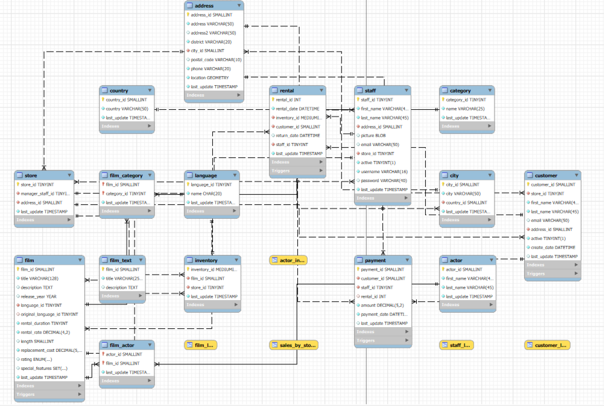

# 🧠 Evaluación Final - Módulo 2: SQL

**Autora:** Romina Altamura\
**Curso:** Data Analytics - Adalab\
**Fecha:** Noviembre 2025

------------------------------------------------------------------------

## 📋 Descripción del proyecto

Este proyecto forma parte de la evaluación final del Módulo 2 del curso
de Data Analytics de Adalab.\
El objetivo es aplicar los conocimientos adquiridos en **SQL**
utilizando la base de datos **Sakila**, que simula una tienda de
alquiler de películas.

**La base de datos Sakila, posee la siguiente estructura:**

----

A lo largo del ejercicio se realizan diferentes consultas para poner en
práctica la extracción, manipulación y análisis de datos mediante SQL.

------------------------------------------------------------------------

## 🧰 Tecnologías utilizadas

-   **MySQL** 
-   **Git & GitHub** para la gestión del repositorio

------------------------------------------------------------------------

## 🧩 Contenido

El archivo principal del proyecto es:\
`Examenfinal-Mod2-RominaAltamura.sql`

Este archivo contiene las consultas que responden a los distintos
ejercicios, entre ellos:
- Selección de datos sin duplicados
- Filtrado por condiciones (`WHERE`, `BETWEEN`, `LIKE`)
- Uso de funciones de agregación (`COUNT`, `AVG`, etc.)
- Agrupaciones y filtrados con `GROUP BY` y `HAVING`
- Uso de distintos tipos de `JOIN`, y subconsultas
- Utilización de condicionales `WHERE` y `HAVING`

------------------------------------------------------------------------

## 🎯 Objetivos de aprendizaje

-   Dominio de consultas en SQL
-   Usar correctamente **joins**, **subconsultas** y **funciones de
    agrupación**    
-   Aplicar buenas prácticas en la escritura y estructura del código
    SQL
-   Practicar la comunicación técnica durante la revisión del ejercicio

------------------------------------------------------------------------

